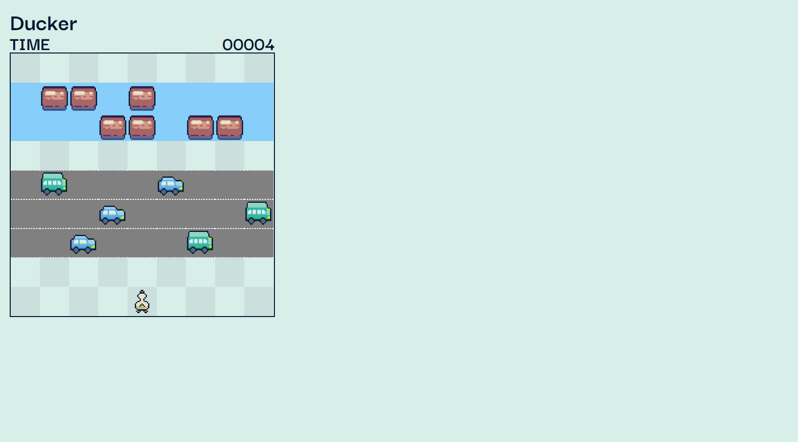
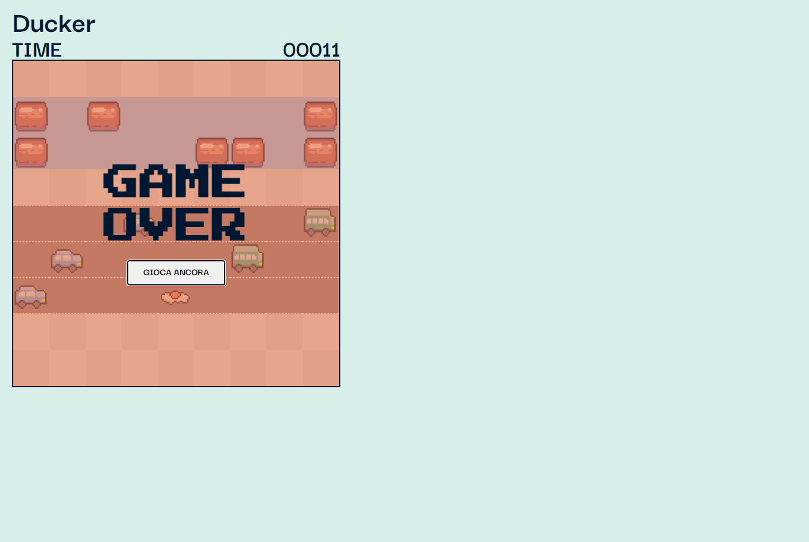
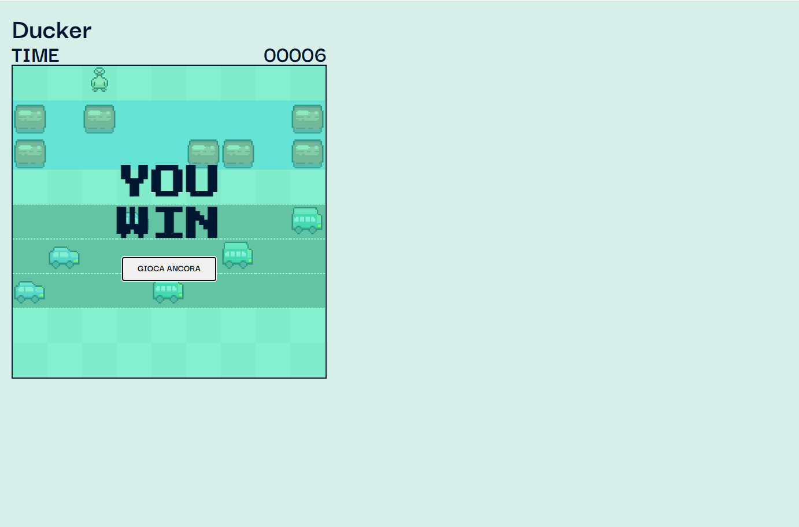

# E-commerce Web App 

Questo progetto è stato creato prendendo spunto dal gioco frogger. 

## Descrizione

Questo progetto chiamato ducker poichè vi è una paperella che attraversa la strada è stato realizzato prendendo spunto dal gioco frogger dove vi è una rana che attraversa la strada. I tronchi e gli autoveicoli si spostano a destra e a sinistra. il tempo scala quindi si hanno alcuni secondi a disposizione prima di oltrepassare i 'pericoli' dopodichè apparirà la schermata hai perso, al contrario se l'utente riuscirà a portare la paperella in salvo prima che scada il tempo apparirà la schermata di vittoria

## Funzionalità

Il gioco include le seguenti funzionalità:

-tronchi e veicoli che si spostano a destra e sinistra
-paperella animata
-paperella che annega/muore
-tempo che retrocede

## Tecnologie utilizzate

Il gioco è stato sviluppato utilizzando le seguenti tecnologie:

- HTML
- CSS
- JavaScript

## Licenza

<!-- Questo progetto è stato rilasciato sotto la licenza MIT. Per ulteriori informazioni, leggere il file `LICENSE.md`. -->

## Crediti

Questo progetto è stato sviluppato da Katia Falletti.(https://it.linkedin.com/in/katia-falletti-616890225?trk=people-guest_people_search-card)
